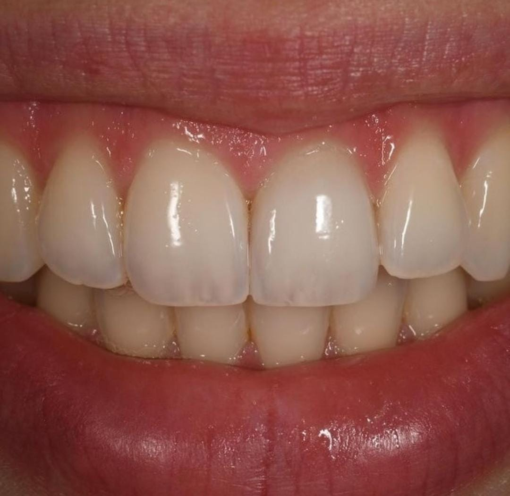
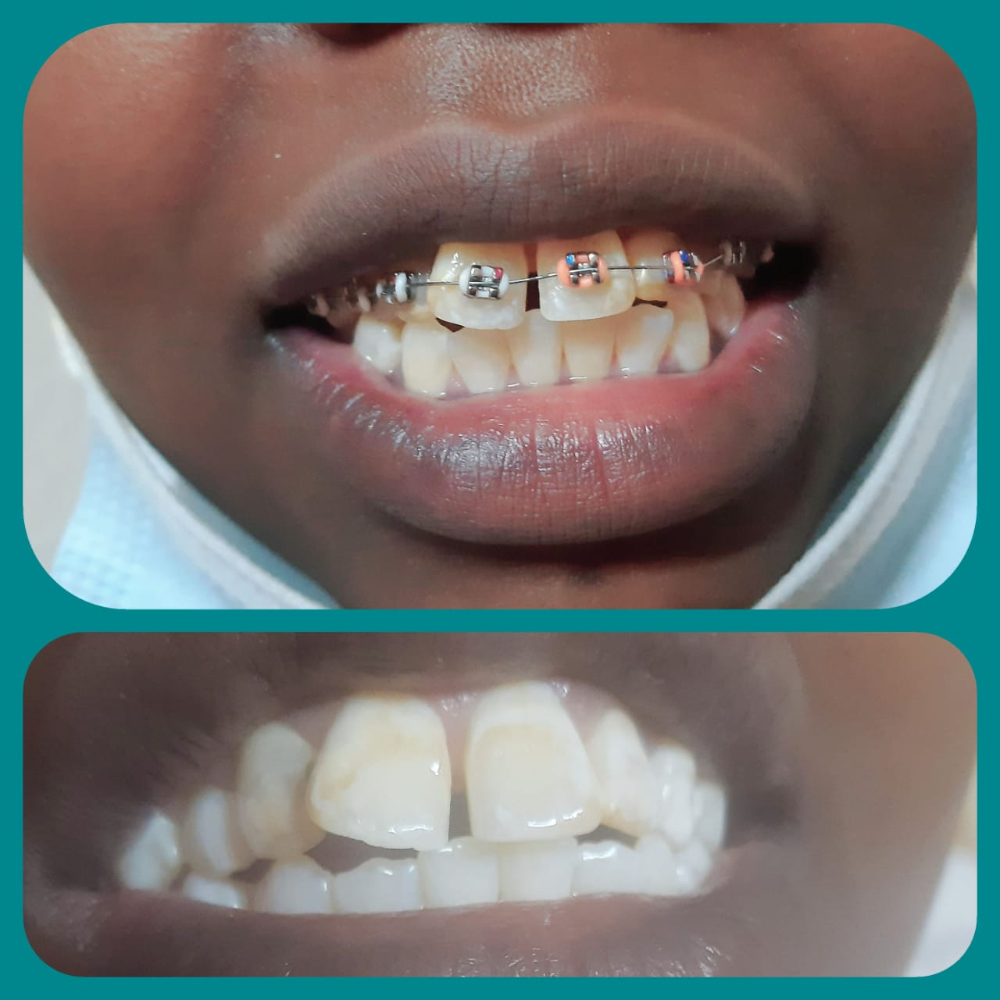
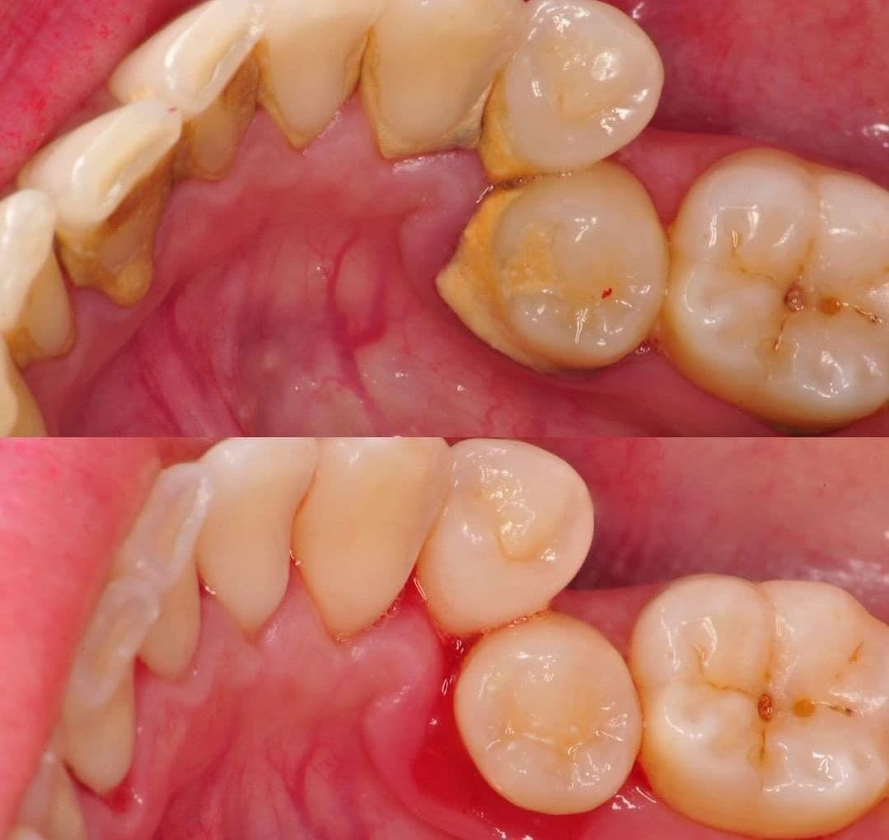

<!DOCTYPE HTML>
<html>
	<head>
		<title>Kamident Dental</title>
		<meta charset="utf-8" />
		<meta name="viewport" content="width=device-width, initial-scale=1, user-scalable=yes" />
		<link rel="shortcut icon" href="logo/favicon.png" type="image/x-icon">
		<meta name="description" content="" />
		<meta name="keywords" content="" />

		<link rel="preconnect" href="https://fonts.gstatic.com">
		<link href="https://fonts.googleapis.com/css2?family=Arapey&family=Fredoka+One&family=Jost:wght@300&family=Pacifico&family=Poiret+One&family=Raleway&family=Vidaloka&display=swap" rel="stylesheet">
		
		<link rel="stylesheet" href="css/mediarules/media.css">
		<link rel="stylesheet" href="css/main/main.css"/>
		
		
	</head>
	<body>

		<!-- Wrapper -->
			

				<!-- Intro -->
				<section class="intro">
					

							<header>
								
									
									<nav>
										<ul>
											<li><a href="#services">Services</a></li>
											
											<li><a href="#contact">Write To Us</a></li>
										</ul>
									</nav>
							
							</header>

						
							
Dental Care that changes your life and leaves you smiling.

							
EXPECT SIMPLY THE BEST.

							

								<button><a href="tel:+254706262436">Book Now On Call</a></button>
								<button class="number"><a href="#contact">Request Consultation</a></button>
							

					

					

						
					

				</section>

				<!-- Word From Dentist	-->
	<section class="first intro">

		

			
		

		
		

			<h2>Word From The Dentist</h2>
			
 "If you feel unhappy about the appearance of your teeth, our smile transformation team will spend the time to deliver a solution unique to you. Our cosmetic dental care is meant to enhance your smile while at the same time improving your whole-body health."

			<h2>Dr. Dan</h2>
		

	
		

	</section>

	

	<section class="second intro">
		<h2>Kamident Dental is a Dental Care Clinic that cares about you and your family's Dental health     </h2>
		

			<h2>These are the services we offer:</h2>
			<ul>
				<li>Root Canals.</li>
				<li>Teeth Whitening.</li>
				<li>Dentures.</li>
				<li>Braces</li>
				<li>Others</li>
			</ul>				

		

		<!-- what we are about-->
		

			<h2>OPENING HOURS:</h2>
			<ul>
				<li>Monday 8am – 7pm</li>
				<li>Tuesday 8am – 5pm</li>
				<li>Wednesday 8am – 5pm</li>
				<li>Thursday 8am – 7pm</li>
				<li>Friday 8am – 5pm</li>
				<li>Saturday 9am – 3pm</li>
				<li>Sunday Emergencies Only</li>
			</ul>
		
		

	</section>

				<!-- Section -->

				<!-- Reviews and feedback -->

	<!-- <section class="reviews"id="reviews">
		<header>
			<h2>Client Reviews and Feedback</h2>
		</header>
		

			
Our clients have left the clinic happier with bigger and whiter smiles. See the reviews below and the BEFORE_AFTER Images

			<ul class="feedback">
				<li> 
					
					
Lorem ipsum dolor sit amet consectetur adipisicing elit. Accusantium ex natus sapiente soluta ipsum enim.

				</li>
				<li> 
					
					
Lorem ipsum dolor sit amet consectetur adipisicing elit. Accusantium ex natus sapiente soluta ipsum enim.

				</li>
				<li> 
					
					
Lorem ipsum dolor sit amet consectetur adipisicing elit. Accusantium ex natus sapiente soluta ipsum enim.

				</li>
				<li> 
					
					
Lorem ipsum dolor sit amet consectetur adipisicing elit. Accusantium ex natus sapiente soluta ipsum enim.

				</li>
				<li> 
					
					
Lorem ipsum dolor sit amet consectetur adipisicing elit. Accusantium ex natus sapiente soluta ipsum enim.

				</li>
				<li> 
					
					
Lorem ipsum dolor sit amet consectetur adipisicing elit. Accusantium ex natus sapiente soluta ipsum enim.

				</li>
				<li> 
					
					
Lorem ipsum dolor sit amet consectetur adipisicing elit. Accusantium ex natus sapiente soluta ipsum enim.

				</li>
			</ul>
			
		

	</section> -->

	<section class="form-map" id="contact">

				
		<form class="" action="index.php#contact" method="POST">
		<h2>Request appointment or Make inquiries.</h2>
			 
			<label for="Name">First Name</label>  
			<input type="text" name="firstname" value="" required="required" placeholder="Your First Name">  
			<label for="Name">Last Name</label>  
			<input type="text" name="lastname" value="" required placeholder="Your Last Name"> 
			 

			<label for="Email">Email</label>  
			<input name="email" type="email" placeholder="Your Email Address"> 
			 

			<label for="Phone Number">Phone Number</label>  
			<input placeholder="Your Phone Number" type="tel" name="tel"> 
			 

			<label for="method">How can we get back to you?</label>  
			
			<input type="radio" id="Email me" name="method" value="Email me">
			<label for="male">Email me</label> 

			<input type="radio" id="Call me" name="method" value="Call me">
			<label for="male">Call me</label> 

			<input type="radio" id="Text me" name="method" value="Text me">
			<label for="male">Text me</label> 
			 
			

			<label for="">Message(Optional)</label>  
			<textarea name="message" id="" cols="30" rows="6" placeholder="Type Here..."></textarea> 

			<input name="submit" value="submit" type="submit"> 				
	   </form>

</section>

	<!-- Section before after images-->
	<section class="afters"id="images">
		<header>
			<h2>Our Clients' AFTER Images</h2>
		</header>
		
		

			<a href="images/rev1.jpeg" class="landscape"> <figcaption>Dentures</figcaption></a>
			<a href="images/rev2.jpeg" class="landscape"> <figcaption>Gum Disease</figcaption></a>
			<a href="images/rev3.jpeg" class="landscape"> <figcaption>Braces</figcaption></a>
			<a href="images/rev4.jpeg" class="landscape"> <figcaption>Tooth Extraction</figcaption></a>
			<a href="images/rev5.jpeg" class="landscape"> <figcaption>Root Canal</figcaption></a>
			<a href="images/rev6.jpeg" class="landscape"> <figcaption>Dental Fillings</figcaption></a>
			<a href="images/rev7.jpeg" class="landscape"> <figcaption>Teeth Whitening</figcaption></a>
		

	</section>

	

					
	<section class="addresses">

		

			    <h3>Quick Links</h3>
				<a href="tel:+254706262436">Call Us</a>
				<a href="#dentist">Meet Your Dentist</a>
				<a href="#services">Services</a>
				<a href="#reviews">Reviews</a>
				<a href="#images">Images</a>
				<a href="#contact">Talk To Us</a>
		
		

		

			<ul>
				<h3>Contacts</h3>
				 

				<li>
					<h3>Email</h3>
					<a href="mailto:kamident@gmail.com">kamident@gmail.com</a>
				</li>
				 
				<li>
					<h3>Phone</h3>
					<a href="tel:+254706262436">0706262436</a>
				</li>
				

			</ul>
		

		

			
Githurai 45, Nairobi, Kenya

			

		   <iframe  frameborder="0" scrolling="no" marginheight="0" marginwidth="0" src="https://maps.google.com/maps?width=100%25&amp;height=600&amp;hl=en&amp;q=Kamident%20Dental%20Clinic,%20Thika%20Road,%20Ruiru+(My%20Business%20Name)&amp;t=&amp;z=14&amp;ie=UTF8&amp;iwloc=B&amp;output=embed">
		   </iframe>
		   
		   

		

	</section>
				
	 <footer>
	
		
&copy; All rights reserved.   Made by: <a target=
			"_blank" href="http://cindykandie.xyz">   CindyKandie</a>.
		

		
	</footer>
	

</body>
</html>
 

 Our dedicated team of experienced dentists is committed to delivering exceptional oral healthcare services to patients of all ages. At Kamident Clinic, we offer a comprehensive range of advanced dental treatments, including teeth whitening, dental implants, orthodontics, cosmetic dentistry, and more.

          We take pride in our state-of-the-art facility, equipped with the latest dental technology to ensure precise and comfortable treatments. Our skilled dentists in Githurai utilize cutting-edge techniques and adhere to strict sterilization protocols, ensuring your safety and well-being at all times.

          As a leading dental clinic in Nairobi, we understand the importance of patient comfort and satisfaction. Our friendly and caring team creates a warm and welcoming environment, helping patients feel at ease during their visit. We prioritize open communication and take the time to listen to your concerns, answering any questions you may have and customizing treatment plans to meet your specific needs.

          Conveniently located in Githurai, Nairobi, our clinic serves the local community and surrounding areas. We are passionate about oral health education and believe in empowering our patients to make informed decisions about their dental care. Our team will provide you with comprehensive oral hygiene instructions and preventive measures to maintain a healthy smile for years to come.

          At Kamident Clinic, we strive to be at the forefront of dental advancements. Our dentists regularly participate in continuing education and training programs, ensuring we offer the latest techniques and treatments available. From routine dental check-ups to complex restorative procedures, our goal is to deliver high-quality, long-lasting results that exceed your expectations.

          Discover the benefits of exceptional dental care at Kamident Clinic in Githurai, Nairobi. Book your appointment today and let our skilled team of dentists transform your oral health. We are dedicated to helping you achieve a beautiful, healthy smile that will boost your confidence and overall well-being.

          Keywords: Githurai dental clinic, Nairobi dental care, teeth whitening Nairobi, dental implants Githurai, orthodontics Nairobi, cosmetic dentistry Githurai, advanced dental treatments Nairobi, experienced dentists Kenya, oral health education, state-of-the-art facility, comfortable dental treatments.